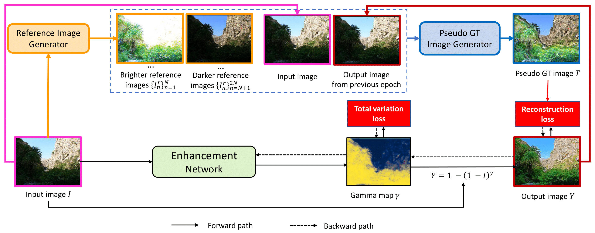

# PSENet: Progressive Self-Enhancement Network for Unsupervised Extreme-Light Image Enhancement
by [Hue Nguyen](https://huent189.github.io/), [Diep Tran](https://www.linkedin.com/in/diep-tran-1407/), [Khoi Nguyen](https://www.khoinguyen.org/), [Rang Nguyen](https://rangnguyen.github.io/)

The extremes of lighting (e.g. too much or too little light) usually cause many troubles for machine and human vision. Many recent works have mainly focused on under-exposure cases where images are often captured in low-light conditions (e.g. nighttime) and achieved promising results for enhancing the quality of images. However, they are inferior to handling images under over-exposure. To mitigate this limitation, we propose a novel unsupervised enhancement framework which is robust against various lighting conditions while doesn't require any well-exposed images to serve as the ground-truths. Our main concept is to construct pseudo-ground-truth images synthesized from multiple source images that simulate all potential exposure scenarios to train the enhancement network. Our extensive experiments show that the proposed approach consistently outperforms the current state-of-the-art unsupervised counterparts in several public datasets in terms of both quantitative metrics and qualitative results.



Details of our framework and benchmark results can be found in [our paper](https://arxiv.org/abs/2210.00712):
```bibtex
@inproceedings{hue2023psenet,
 author={Hue Nguyen and Diep Tran and Khoi Nguyen and Rang Nguyen},
 booktitle={Proceedings of the IEEE/CVF Winter Conference on Applications of Computer Vision (WACV)},
 title={PSENet: Progressive Self-Enhancement Network for Unsupervised Extreme-Light Image Enhancement},
 year= {2023}
}
```
**Please CITE** our paper when this repository is used to help produce published results or is incorporated into other software.

## Installation
1. Clone this repository
```bash
git clone https://github.com/VinAIResearch/PSENet-Image-Enhancement.git
cd PSENet-Image-Enhancement
```
2. Setup the environment
```bash
conda create -n psenet python=3.7
conda activate psenet
pip install -r requirements.txt
```
## Demo
For a quick demo, please run the following command
```bash
cd source
python demo.py 
```
## Training and evaluation
### Data Preparation
Please refer to the below links for downloading datasets.
1. SICE dataset
- [training set](https://drive.google.com/file/d/1GAB3uGsmAyLgtDBDONbil08vVu5wJcG3/view): the customed version of SICE part 1 dataset introduced in ZeroDCE paper. 
- [testing set](https://drive.google.com/file/d/16VoHNPAZ5Js19zspjFOsKiGRrfkDgHoN/view): SICE part 2 dataset. Note that the results reported in the main paper are evaluated on resized images with 0.25 of their original size due to memory constraints.
2. [Afifi dataset](https://github.com/mahmoudnafifi/Exposure_Correction#dataset)
3. [LOL dataset (for evaluation only)](https://daooshee.github.io/BMVC2018website/): Both training and evaluation sets are used for evaluation in the main paper.

Unzip all downloaded datasets to data_root folder to match with the following data structure.
```
PSENet-Image-Enhancement
├─ assets
├─ data_root
│  ├─ LOLdataset.zip
│  ├─ afifi
│  │  ├─ testing
│  │  │  ├─ INPUT_IMAGES
│  │  │  └─ expert_e_testing_set
│  │  └─ training
│  │     └─ INPUT_IMAGES
│  ├─ lol
│  │  ├─ eval15
│  │  │  ├─ high
│  │  │  └─ low
│  │  └─ our485
│  │     ├─ high
│  │     └─ low
│  └─ sice
│     └─ Dataset_Part2
│        ├─ 1
│        ├─ 2
│        ├─ ...
│        └─ Label
│           ├─ 1.JPG
│           ├─ 2.JPG
|           └─ ...
├─ pretrained
├─ source
├─ README.md
├─ requirements.txt
├─ LICENSE
└─ .gitignore
```
### Training 
1. SICE dataset
```bash
cd source
python main.py --config configs/sice.yaml
```
2. Afifi dataset
```bash
cd source
python main.py --config configs/afifi.yaml
```
For custom config, please check the comment in `source/configs/sice.yaml`
### Testing
Our pretrained models are provided in folder `pretrained`. To reproduce the quantitative results reported in the main paper, please run the following commands.
1. SICE dataset
```bash
cd source
python main.py --config configs/sice.yaml --pipeline test --checkpoint ../pretrained/sice.pth 
```
2. Afifi dataset
```bash
cd source
python main.py --config configs/afifi.yaml --pipeline test --checkpoint ../pretrained/afifi.pth 
```
3. LOL dataset
```bash
cd source
python main.py --config configs/lol.yaml --pipeline test --checkpoint ../pretrained/sice.pth 
```
## Acknowledgements
The image enhancement model is built upon [MobileNetV3_PyTorch](https://github.com/PengBoXiangShang/MobileNetV3_PyTorch). We thank the authors for providing helpful functions in our work.

## Contacts
If you have any questions or suggestions about this repo, please feel free to contact me (nthue189@gmail.com).
